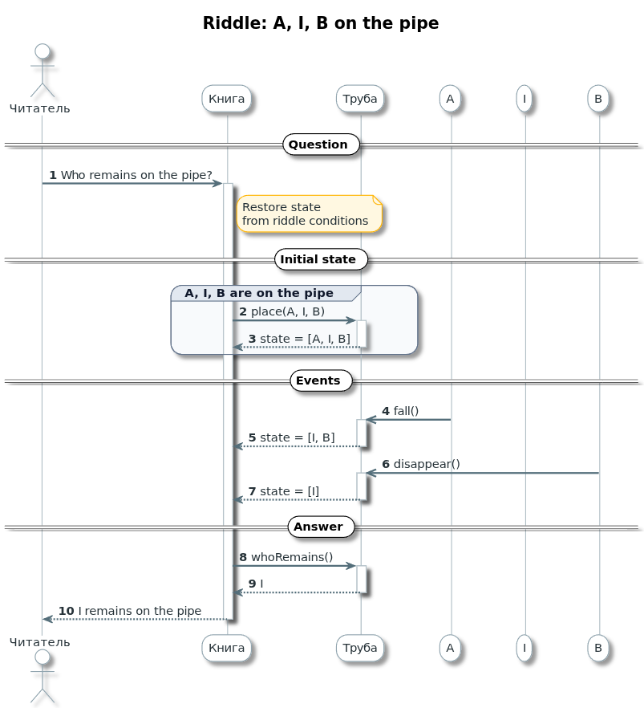
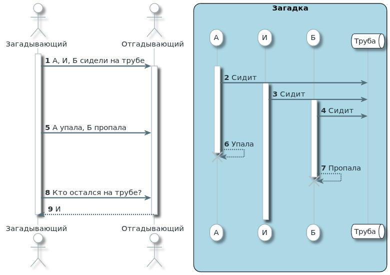
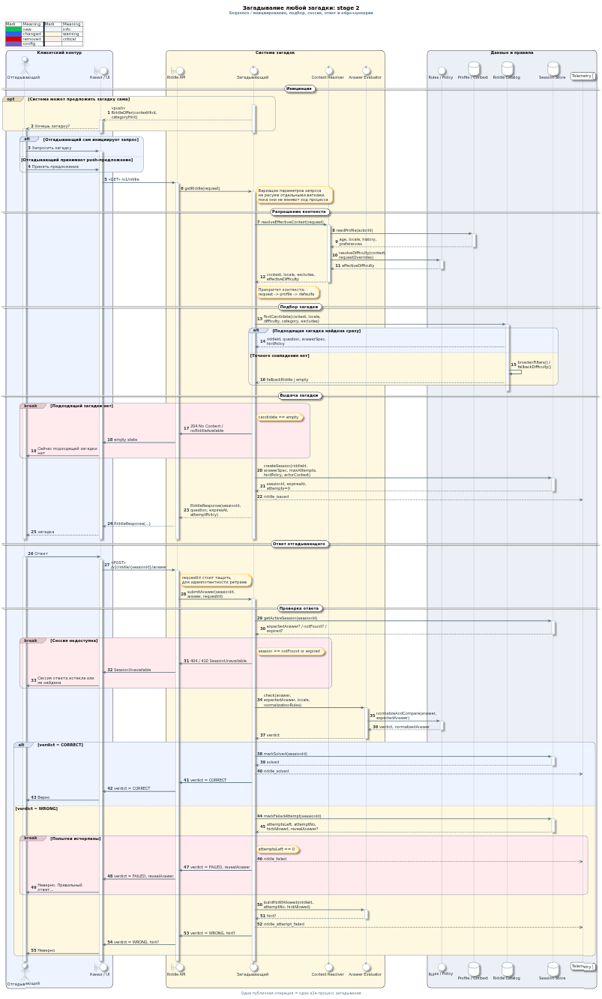
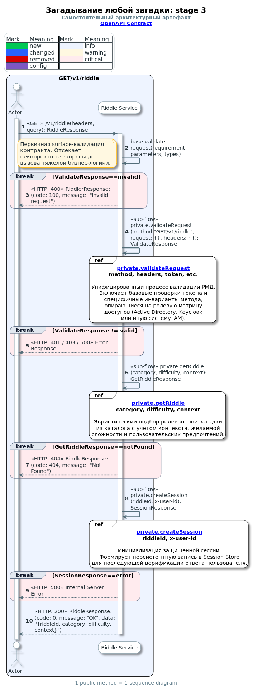

# 🎨 Sequence: От Sparx к PlantUML — путь к идеальным диаграммам

> **Один пост в неделю — ха!** Не больше одного поста в неделю. Работкой завалило) Однако в этом есть и свои плюсы. Знаете какие? Я делал первые в своей жизни PlantUML-диаграммы и C4-like (тут я знатно сгорел с позиционированием элементов), и, конечно же, большущий god-sequence, который впоследствии был распилен.

## 🚀 Мой путь к архитектуре

Как так получилось, что solution architect не рисовал в PlantUML? Да всё просто: я соевый архитектор, воспитанный одиночеством и необходимостью работать в Sparx Enterprise Architect.

Когда мне впервые доверили подправить сиквенс в команде PM/IM, я только знал, что архитекторы рисуют стрелочки в своей неведомой халабуде. На тот момент я был типа мидл SRE с опытом работы в IT почти год без хвостика. Диаграмма была простая до нельзя, но главное — нужной гранулярности. Она объясняла один конкретный процесс в конкретной системе, и, насколько помню, там был всего один lifeline.

Тогда мне выдали учётку в Sparx и указали, что делать. Изменение было суперпростым, а вот Sparx — нет. Спойлер: он не очень user-friendly, особенно к молодому юнцу. Было мне тогда 28 лет. Молодой, шутливый, ещё не знающий, что ждёт на этом крайне необычном пути.

Помню, незадолго до этого у меня состоялся разговор с начальником по поводу развития, где он спрашивал, какой карьерный трек я выбираю. На что я ответил: «разрабом». Писал тогда скрипты на Python и активно изучал всё, что с этим связано. Потом ещё одна такая встреча, тот же вопрос, тот же ответ. Но тут начальник выдаёт: «А может, архитектором?»

К тому моменту я учил Java, потому что стек такой в команде. После Python Java не зашла, и я согласился. На тот момент уже рисовал всякие схемки, чтобы без меня сервисы в моей зоне мог подхватить любой. Рисовал тогда в Gliffy, который был встроен в Confluence.

Теперь переместимся в момент, когда я уже стал системным архитектором финсервисов и мне нужно было рисовать сиквенсы. Сначала — про доработки легаси, чтобы потом осуществить грандиозную миграцию на новый биллинг. Потом — новые сервисы, дружащие с легаси. Потом — уже без легаси, красивые.

Всё это время я проходил трансформацию от подражателя до художника, с которым лучше не спорить, иначе он в приступе ярости с пеной у рта будет тыкать пальцем в сиквенс и объяснять, что надо делать так, а не иначе, потому что он не просто так это рисовал и думал обо всех возможных ситуациях.

Проходил этот путь по большей части в одиночестве и часто методом научного тыка. И, конечно же, по доке Sparx. Тут им отдельный респект, потому что можно ткнуть на непонятный элемент, нажать F1, и тебя перебросит на страницу документации именно по нему. Ну и, конечно, пользовался нейросетями всех мастей и размеров. Исключая локальные — железо не позволяет.

Научился всякому в Sparx, но, мне кажется, и половины его реального функционала не познал в полной мере. Коротко ли, долго ли, у меня сформировалось видение того, как должен выглядеть идеальный сиквенс системного архитектора.

## ⚠️ Sparx: плюсы и минусы

Sparx хоть и перекрывал все мои потребности как архитектора, однако так вышло, что в компании на него все забили и в лучшем случае используют как рисовалку. Скажу сразу чётко и ясно: такой подход осуждаю. Артефакт ради артефакта — это мусор. Он не трассируем, не прозрачен и лежит чёрти где.

Все артефакты архитектурной, да и не только, должны лежать рядом, в одном архитектурном репозитории. Такой подход позволяет приземлиться от процесса до машины, на которой он крутится. И Sparx это в теории позволяет.

EA — инструмент исключительно профессиональный, с высоким порогом входа, от чего и страдает. Чтобы приземлять архитектуру от бизнес-процесса и максимально легко вносить изменения в системы любой сложности, нужен штат сотрудников, обученных работе в Sparx. И я говорю не только про архитекторов разного уровня, но и про аналитиков, в том числе бизнес-аналитиков.

Но в современных реалиях он уже абсолютно устаревший: плохое версионирование, нестабильная работа и много чего ещё. Поэтому приходится, даже с развитым скиллом в Sparx, переходить на другие решения, в частности на архитектуру как код. А что будет логичным шагом? Правильно — начать осваивать PlantUML.

## 🌟 PlantUML: новый уровень

Сиквенсы в PlantUML выглядят неплохо, но не так хорошо, как я привык. Плюс мои заскоки: что нужно делать красиво, минимизировать когнитивную нагрузку на читателя и как можно чётче задавать рамки поведения в рамках прорабатываемого процесса. Всё это привело к тому, что я пошёл кричать на ChatGPT, что мне надо красиво «как я люблю» (да, мой ChatGPT делает хорошо даже с такого промта, про это я тоже расскажу потом).

В итоге он выдал мне стили и процедурки внутри них, которые можно использовать как теги для автоматической покраски стрелочек в соответствии с легендой, вынесенной в тот же файл стиля. Теперь в каждой такой диаграмме делаю импорт и добавляю всё, что нужно мне.

Я очень люблю, когда что-то переиспользуется. Ещё со времён работы оператором чата в контактном центре я усвоил золотое правило: если что-то повторяется — сделай шаблон и переиспользуй. Перекладывая это на архитектуру, мы получаем модульность. Зачем повторять одно и то же несколько раз? Приватные методы, уровни абстракции — всё это позволяет проектировать быстрее и проще. А новые уровни абстракции часто помогают решить задачи, которые раньше казались нерешаемыми.

## 🛠️ Мои стили и тэги в PlantUML

Чтобы сделать диаграммы идеальными, я разработал систему стилей и тэгов. Вот ключевые элементы:

- **Цветовая кодировка**: `$BG_INFO` для информационных блоков, `$BG_WARN` для системных, `$BG_CFG` для данных.
- **Тэги для стрелок**: `[$C_NEW]` для создания, `[$C_DEL]` для удаления, `[$C_CHG]` для изменений.
- **Фреймы**: `#$FR_CRIT_HEAD #$FR_CRIT_BG` для критических сценариев, `#$FR_INFO_HEAD #$FR_INFO_BG` для информационных.
- **Легенда**: `SEQ_LEGEND_STATUS()` — автоматическая генерация легенды с цветами и значками.
- **Макросы**: `$B()` для жирного текста, `$SM()` для мелкого, `$MUTED()` для приглушённого.

Эти стили хранятся в [artifacts/templates/styles/\_style_seq.puml](../../../artifacts/templates/styles/_style_seq.puml) и импортируются в каждую диаграмму.

## 🎯 Пример: загадка про трубу

Много слов, мало дела. Нужно начать собирать сиквенс мечты. Делать его будем на примере детской загадки: «А, И, Б сидели на трубе. А упала, Б пропала. Кто остался на трубе?»

Начнём с определения действующих лиц: Загадывающий \ Отгадывающий \ А \ И \ Б \ Труба.

И начнём отрисовывать базовую логику:


Вот что получается:



[Открыть PUML-файл](../../../artifacts/diagrams/sequence/seq_riddle_a_i_b_on_pipe.puml)

Выглядит неплохо, продолжаем тюнить и обогащать информацией и раскладывать всё по полочкам.

Отступы делаю как чувствую, чтобы сквозным читать код диаграммы насквозь при написании.

```
@startuml
!include ../../../artifacts/templates/styles/_style_seq.puml

autonumber

actor "Загадывающий" as riddler
actor "Отгадывающий" as solver

box "Загадка" #LightBlue
    participant "А" as a
    participant "И" as i
    participant "Б" as b
    queue "Труба" as pipe
end box

activate riddler
    riddler -> solver: А, И, Б сидели на трубе
    activate solver
        activate a
            a  -> pipe : Сидит
            activate i
                i -> pipe : Сидит
                    activate b
                        b -> pipe : Сидит
    riddler -> solver : А упала, Б пропала
            a --> a : Упала
        destroy a
                        b --> b : Пропала
                    destroy b
    riddler -> solver : Кто остался на трубе?
        solver --> riddler : И
    deactivate solver
deactivate riddler

@enduml
```



Всё получается наглядно и понятно, но выглядит слишком верхнеуровнево, не так ли?

До системного sequence diagram это точно не дотягивает. Значит, нужно декомпозировать. Хлебом не корми — дай что-нибудь подекомпозировать.

Итак, что у нас есть:

- **Загадывающий** — это система.
- **Отгадывающий** — это актор.
- **Загадывание загадки** — публичный метод, который реализует система.
- **Конкретная загадка** — уже приватная реализация, потому что загадок много, и заранее мы не знаем, какую именно выберет загадывающий.

И, конечно, нельзя забывать, что даже в такой простой истории есть не только "вопрос → ответ", но и целая цепочка действий, проверок и логических развилок. А значит — без `alt` и нормальной декомпозиции тут не обойтись.

## 📊 Декомпозиция: от простого к сложному

Это был первый набросок, потом меня понесло...

<details>
<summary>🚨 Пример переусложнённой диаграммы (не делайте так!)</summary>



Смотреть исходник диаграммы в файле: [seq_process stage 2.puml](../../../artifacts/diagrams/sequence/seq_process%20stage%202.puml)

</details>

Получилось нечитаемо и слишком упоролся в декомпозицию, но меня расшменило.

Теперь у нас есть несколько примеров того как НЕ должны выглядеть диаграммы системного архитектора. Хоть на диаграмме много деталей, но они теряются в общем месиве спагетти диаграммы. Мозгу просто тяжело начать её смотреть, про понимать вообще молчу.

Я пропагандирую всяческое снижение когнитивной нагрузки на читателя и иду к этому различными путями: интуитивно понятные визуальные метафоры, цветовая кодировка, легенды, вынос сложных вещей в отдельные диаграммы и так далее. Здесь уже есть подстветка критичных моментов, легенда, но всё равно это не спасает от ощущения, что ты смотришь на какую-то кашу из линий и блоков.

## 📋 10 правил идеального сиквенса

У меня за время работы сложились некоторые правила, которые помогают держать диаграммы понятными, читабельными и реализуемыми. Вот главные из них:

1. **Одна диаграмма - один публичный метод.** Не пытайтесь запихнуть весь API в одну схему.
2. **Приватные методы выносите отдельно.** Если процесс повторяется, сделайте ref на приватную диаграмму с аргументами.
3. **Показывайте все параметры.** На диаграмме должен быть полный набор входов, а логика — в фреймах.
4. **Унификация.** Внешний потребитель — чёрная коробка по контракту.
5. **Цветовая кодировка.** Мои стили: `$BG_INFO`, `$BG_WARN`, `$BG_CFG` — придерживайтесь.
6. **Легенда обязательна.** `SEQ_LEGEND_STATUS()` — и читатель понимает цвета.
7. **Дополняйте другими артефактами.** Классы, state, activity — не игнорируйте.
8. **Полная закрытость вопросов.** Никакой недосказанности в области диаграммы.
9. **Визуальная эстетика.** Шрифты, цвета, отступы — делайте приятно для глаз.
10. **Обратная связь.** Собирайте фидбек и улучшайте.

## 🎯 Реализация: Riddler Service

А теперь я сам без ИИ раскидаю загадку на несколько диаграмм, чтобы показать, как это может выглядеть в идеале. Уточнение что мы строим конкретную реализацию, небольшой микросервис, чтобы опять не упороться.

Так у меня конечно же не получилось, и я упоролся. Дальше подтянул нейросеть, сделал первую диаграмму руками, а остальные — по моим гайдлайнам.

Началось всё безобидно, с GET/v1/riddle:



А потом меня понесло конкретно. Заставил Gemini Code Assist нарисовать диаграммы для других методов.

- [GET /v1/riddle → seq_api_get_riddle.puml](../../../artifacts/diagrams/sequence/Riddler%20Service/public/seq_api_get_riddle.puml)
- [POST /v1/riddle/{riddleId}/answer → seq_api_post_answer.puml](../../../artifacts/diagrams/sequence/Riddler%20Service/public/seq_api_post_answer.puml)
- [POST /v1/riddle → seq_api_post_riddle.puml](../../../artifacts/diagrams/sequence/Riddler%20Service/public/seq_api_post_riddle.puml)
- [PUT /v1/riddle/{riddleId} → seq_api_put_riddle.puml](../../../artifacts/diagrams/sequence/Riddler%20Service/public/seq_api_put_riddle.puml)
- [DELETE /v1/riddle/{riddleId} → seq_api_delete_riddle.puml](../../../artifacts/diagrams/sequence/Riddler%20Service/public/seq_api_delete_riddle.puml)
- [GET /v1/riddles/search → seq_api_search_riddles.puml](../../../artifacts/diagrams/sequence/Riddler%20Service/public/seq_api_search_riddles.puml)

И так далее для всех эндпоинтов. Все диаграммы в [папке](../../../artifacts/diagrams/sequence/Riddler%20Service/).

Потом сгенерировали контракт по такому случаю, а затем написали сервис фактически с пары запросов к Gemini, подняли локально, и оно работает!

```bash
curl -X 'GET' \
  'http://localhost:8000/v1/riddle' \
  -H 'accept: application/json' \
  -H 'x-user-id: test-user'
{"code":0,"message":"OK","data":{"riddleId":"50fbb62e-2b24-404a-b86c-d7ab7ab07451","category":"Логика","difficulty":"Средняя","context":"Для всех","question":"А, И, Б сидели на трубе. А упала, Б пропала, кто остался на трубе?"}}
```

Распознает неверный запрос:

```bash
curl -X 'POST' \
  'http://localhost:8000/v1/riddle/ВАШ_RIDDLE_ID/answer' \
  -H 'accept: application/json' \
  -H 'x-user-id: test-user' \
  -H 'Content-Type: application/json' \
  -d '{"answer": "Б"}'
{"detail":"Session not found or expired"}
```

## 🧪 Тестирование и ускорение

На основе диаграмм мы написали полный тест-дизайн и прогнали тесты. Результат: 15 passed, 0 failed. Подробности в [отчете](../../../artifacts/diagrams/sequence/Riddler%20Service/Service/TEST_REPORT.md).

Ключевой инсайт: Sequence-Driven Development (SDD) ускоряет разработку в 2.5-4 раза!

- **TTM (Time-to-Market):** С диаграммами — 1.5 часа вместо 4-6.
- **TTC (Time-to-Comprehension):** QA тратит <15 мин вместо 1-2 часов.
- **Качество:** Диаграммы — контракт поведения, снижают баги и улучшают коммуникацию.

## 📈 Влияние на корпоративные метрики

- **Снижение TTM:** Быстрее выводим фичи, меньше задержек.
- **Улучшение качества:** Меньше багов → меньше поддержки.
- **Архитектурный надзор:** Диаграммы — живая документация, легче онбординг.
- **Изменения:** Легче модифицировать код по схемам.
- **Командная эффективность:** Унификация стилей снижает когнитивную нагрузку.

Но помните: сиквенс — не единственный артефакт. Добавляйте класс-диаграммы, state-диаграммы, activity-диаграммы. Они дополняют картину и не дают упороться в одну сторону.

## 🔗 Ссылки

- **Проект:** [GitHub: NaqpaniA/NqpArch](https://github.com/NaqpaniA/NqpArch)
- **Канал:** [Telegram: @nqparch](https://t.me/nqparch)
- **Сервис Riddler:** [Полный код и диаграммы](../../../artifacts/diagrams/sequence/Riddler%20Service/)
- **Стили PlantUML:** [Тэги и цвета](../../../artifacts/templates/styles/_style_seq.puml)
- **Отчёт SDD:** [Development Acceleration Report](Development_Acceleration_Report.md)
- **Подводка:** [Onboarding архитектора без героизма](../onboarding-with-sequence.md)

---

В общем, друзья, делайте диаграммы красивыми, декомпозированными и полезными. Это ускорит вашу разработку и сделает архитектуру прозрачной. Удачи! 🚀
