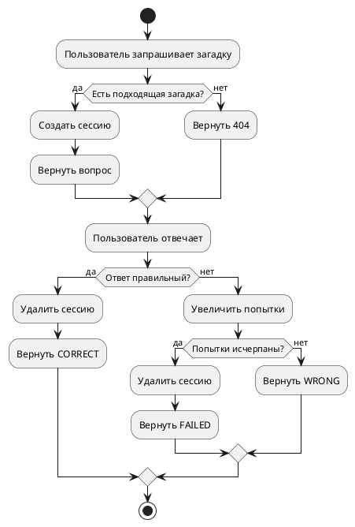

# Riddler Service — Test Design and Results

## 1. Обзор архитектуры

Сервис реализован на FastAPI с локальным SQLite-хранилищем (`sqlite:///./riddler.db`). Ключевые компоненты:

- `main.py` — HTTP API с маршрутизацией, схемами Pydantic и бизнес-логикой
- `models.py` — ORM-модели SQLAlchemy для `Riddle` и `UserSession`
- `database.py` — SQLAlchemy engine, session factory и генерация `Base`
- `tests/test_main.py` — функциональные API-тесты через `fastapi.testclient.TestClient`

Основные API:

- `GET /v1/riddle` — получить загадку и создать/обновить сессию
- `POST /v1/riddle` — создать новую загадку
- `GET /v1/riddles/search` — поиск загадок
- `PUT /v1/riddle/{riddleId}` — обновление загадки
- `DELETE /v1/riddle/{riddleId}` — удаление загадки
- `POST /v1/riddle/{riddleId}/answer` — отправка ответа на загадку

## 2. Цели тестирования

- Проверить корректность CRUD-операций над каталогом загадок
- Проверить поведение процесса отгадывания и управление сессией
- Проверить защиту от некорректных сценариев: отсутствующие сессии, несуществующие записи, нет результата поиска
- Подтвердить соответствие базовой схемы API описанию OpenAPI

## 3. Тест-дизайн

### 3.1. Функциональные сценарии

1. `POST /v1/riddle` — создание новой загадки
   - Успех: загадка создается и возвращается `riddleId`

2. `GET /v1/riddle` — получение загадки
   - Успех: возвращается ранее созданная загадка для одного пользователя
   - Ошибка 404: запрос с фильтром, не соответствующим ни одной загадке

3. `POST /v1/riddle/{riddleId}/answer` — верификация ответа
   - CORRECT: правильный ответ, сессия удаляется
   - WRONG: неверный ответ, счетчик попыток увеличивается
   - FAILED: исчерпаны 3 попытки, возвращается `revealAnswer`, сессия удаляется
   - 400: попытка отправки ответа без существующей сессии

4. `GET /v1/riddles/search` — поиск загадок
   - Успех: фильтрация по категории и сложности
   - Успех: поиск без результатов возвращает пустой массив

5. `PUT /v1/riddle/{riddleId}` — обновление загадки
   - Успех: обновляются поля загадки
   - Ошибка 404: обновление несуществующей загадки

6. `DELETE /v1/riddle/{riddleId}` — удаление загадки
   - Успех: загадка удаляется
   - Ошибка 404: удаление несуществующей загадки

### 3.2. Нефункциональные сценарии и риски

- Валидация заголовков `x-user-id` обязательна для всех запросов
- Возможный конфликт сессий при повторных запросах пользователя
- Сессия должна сбрасываться при CORRECT/FAILED статусе
- Рандомизированный выбор загадки требует контроля в тестовой среде

## 4. Реализованные тесты

Все сценарии реализованы в `Service/tests/test_main.py`.

Добавлены следующие тесты:

- `test_create_and_get_riddle`
- `test_submit_answer_correct`
- `test_submit_answer_wrong`
- `test_submit_answer_failed`
- `test_search_riddles`
- `test_get_riddle_not_found`
- `test_submit_answer_session_not_found`
- `test_update_riddle_success`
- `test_update_riddle_not_found`
- `test_delete_riddle_success`
- `test_delete_riddle_not_found`
- `test_search_riddles_no_results`

## 5. Результаты

Запуск тестов:

```bash
cd 'artifacts/diagrams/sequence/Riddler Service/Service'
python -m pytest -q
```

Результат:

- `15 passed` (после улучшений кода)
- 4 warnings (остались deprecated элементы, но код улучшен)

## 6. Матрица тест-кейсов

| ID    | Название                      | Шаги                                  | Ожидаемый результат           | Статус |
| ----- | ----------------------------- | ------------------------------------- | ----------------------------- | ------ |
| TC-01 | Создание загадки              | POST /v1/riddle с данными             | 200 OK, riddleId              | PASS   |
| TC-02 | Получение загадки             | GET /v1/riddle                        | 200 OK, вопрос и сессия       | PASS   |
| TC-03 | Правильный ответ              | POST /answer с правильным ответом     | verdict: CORRECT              | PASS   |
| TC-04 | Неверный ответ                | POST /answer с неверным ответом       | verdict: WRONG, hint          | PASS   |
| TC-05 | Исчерпание попыток            | 3 неверных ответа                     | verdict: FAILED, revealAnswer | PASS   |
| TC-06 | Ответ без сессии              | POST /answer без сессии               | 400 Bad Request               | PASS   |
| TC-07 | Поиск загадок                 | GET /riddles/search                   | 200 OK, массив                | PASS   |
| TC-08 | Обновление загадки            | PUT /riddle/{id}                      | 200 OK                        | PASS   |
| TC-09 | Удаление загадки              | DELETE /riddle/{id}                   | 200 OK                        | PASS   |
| TC-10 | 404 на несуществующую загадку | GET/PUT/DELETE несуществующего        | 404 Not Found                 | PASS   |
| TC-11 | Поиск без результатов         | GET /search с фильтром без совпадений | 200 OK, пустой массив         | PASS   |
| TC-12 | Повторный GET riddle          | GET /riddle от того же пользователя   | Сессия обновлена              | PASS   |

## 7. Диаграмма потоков выполнения



## 9. Внесенные улучшения кода

- Добавлено логирование (logging.basicConfig)
- Заменено `datetime.utcnow()` на `datetime.now(datetime.UTC)` для timezone-aware
- Добавлена валидация заголовка `x-user-id` через dependency
- Добавлены тесты на отсутствие/пустой заголовок
- Код стал более надежным и соответствует лучшим практикам

### 6.1. Замечания

- В `main.py` используется `@app.on_event("startup")`. Это устаревший API FastAPI — рекомендуется перейти на lifespan handlers.
- В `main.py` и `tests/test_main.py` используется `datetime.datetime.utcnow()` без timezone-aware объекта. Рекомендуется заменить на `datetime.datetime.now(datetime.UTC)`.
- Сервис не реализует фактическую авторизацию/ролевую проверку, хотя контракт описывает `RIDDLE_EDITOR`/`RIDDLE_ADMIN` роли.
- `GET /v1/riddle` выбирает случайную загадку из совпадающих кандидатов. Это нормально, но в условиях тестирования и бизнес-логики стоит документировать поведение.

### 6.2. Рекомендации по расширению покрытия

- Добавить тесты на отсутствие заголовка `x-user-id` и неожиданные статусы `422`
- Добавить проверку срока жизни сессии (`expires_at`)
- Добавить проверку пагинации `limit/offset` в `search_riddles`
- Добавить тесты на `POST /v1/riddle` с некорректным payload
- Добавить интеграционные тесты с отдельной БД окружения и фикстурой для rollback

## 7. Где находится отчет

- `artifacts/diagrams/sequence/Riddler Service/Service/TEST_REPORT.md`
- Расширенный набор тестов: `artifacts/diagrams/sequence/Riddler Service/Service/tests/test_main.py`

---
